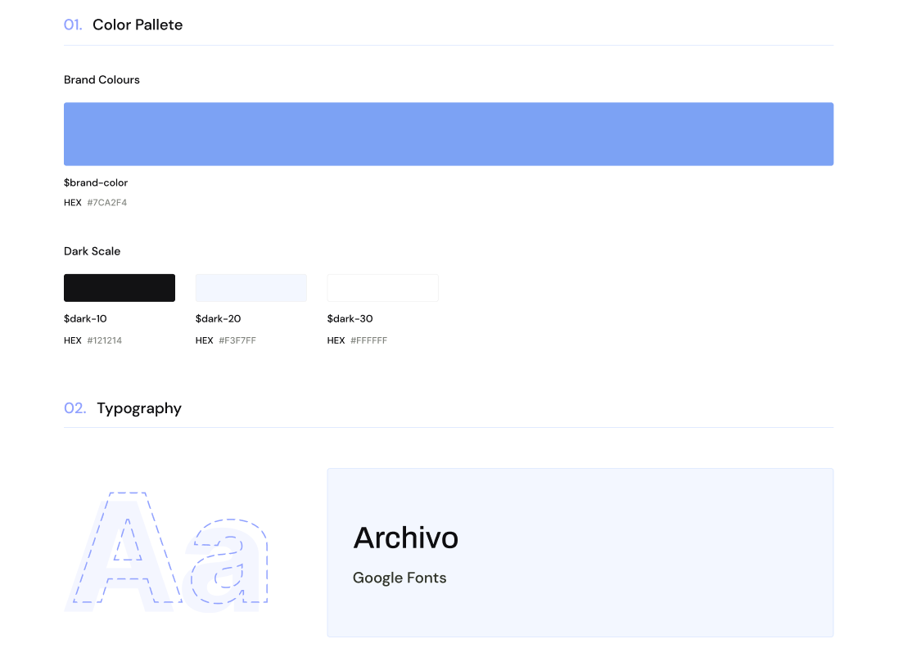
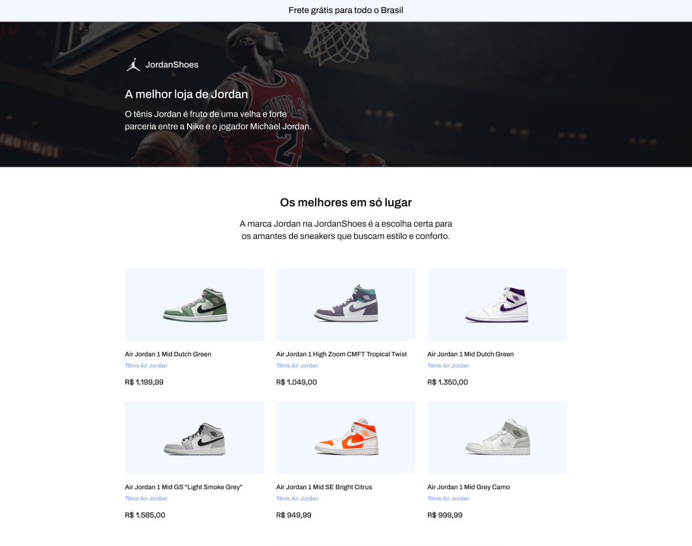
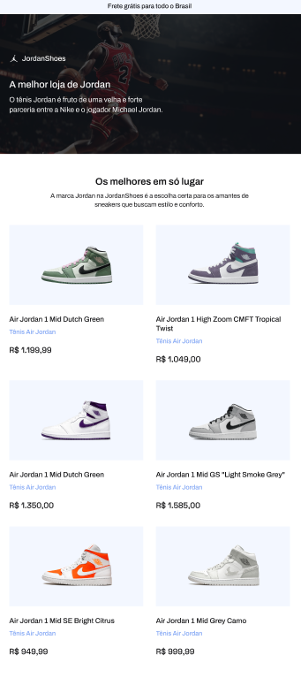

 # Projeto JordanShoes
 
 Neste exercício, você deverá replicar a tela principal de uma loja fictícia de tênis Jordan, utilizando HTML e CSS (frameworks são opcionais e ficam a critério do aluno). Seu objetivo é criar uma página responsiva que imite o design apresentado nas imagens de referência, respeitando a paleta de cores fornecida.


 
> Importante: 
> Busque seguir a estrutura HTML corretamente, 
> respeitando as hierarquias e a semântica.

## Style Guide

> Cores predominantes: 
```
HEX #7CA2F4
HEX #121214 
HEX #F3F7FF
HEX #FFFFFF
```

> Fonte: [Archivo](https://fonts.google.com/specimen/Archivo)










# Links complementares


- [Tabela de cores hexadecimal](https://celke.com.br/artigo/tabela-de-cores-html-nome-hexadecimal-rgb)
- [Gradient color](https://cssgradient.io/)
- [Doc firefox HTML](https://developer.mozilla.org/pt-BR/docs/Web/HTML)
- [Doc firefox CSS](https://developer.mozilla.org/pt-BR/docs/Web/CSS)

