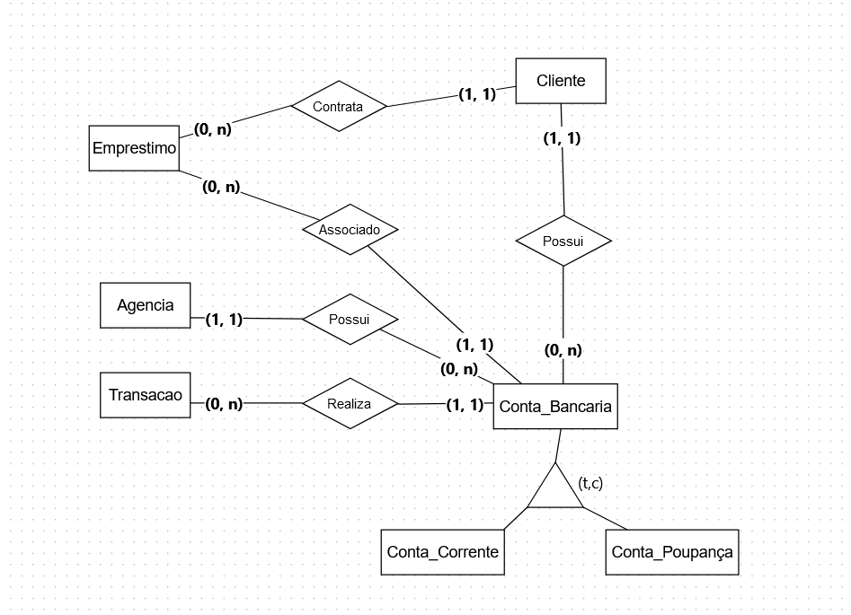
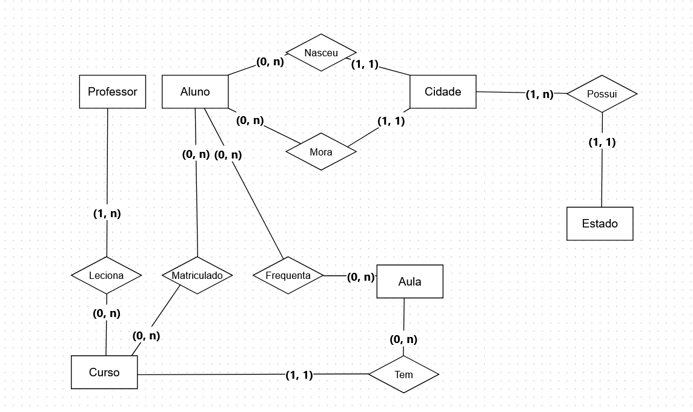

2. 
Possível solução de diagramação ER(faltou adicionar atributos): 



Esquema com atributos:
cliente:
id_cliente, nome, cpf, data_nascimento, endereço

```  
conta_bancaria:
numero_conta, id_cliente, tipo_conta(enum), saldo, data_abertura, id_agencia

		^ 
		| 
		| 

conta_corrente:   conta_poupança:
limite_especial   taxa_juros 
```

agencia:
codigo_agencia, nome, endereço

transacao:
id_transacao, numero_conta, tipo_transacao(enum), valor, data_transacao

cliente_emprestimo
id_emprestimo, id_cliente

emprestimo
id_emprestimo, valor_emprestimo, data_aprovacao, data_vencimento, numero_conta


1. 
Possível solução de diagramação ER (faltou adicionar os atributos):



Esquema com atributos:

Aluno:
aluno_id, primeiro_nome, ultimo_nome, data_nascimento, sexo, casado(boolean), 
numero_filhos , cidade_nascimento_id, cidade_residencia_id

cidade:
cidade_id, nome, estado_id

estado:
estadao_id, nome, sigla

curso:
curso_id, nome, numero_aulas 

curso_professor:
id_curso, id_professor

professor:
professor_id, primeiro_nome, ultimo_nome, afiliação?, campo_especialização?

aula:
aula_id, curso_id, data_aula, conteudo

inscrição_curso:
inscricao_id, participante_id, curso_id, periodo_inscricao


3. 

4. 

#### Suposições:

- Placa é um campo único

- O campo make se refere a empresa que fabricou o carro
- O país em que foi feito se refere a apenas UM país
- O relacionamento de compra entre car e owner viraria uma tabela no banco de dados, relacionando o carro ao dono, com o preço e a taxa 
- Owner possui apenas UM numero de telefone 
- Owner possui apenas UM estado 
- Owner possui apenas UM código de área

Com base nessas suposições, podemos alegar que o esquema já se encontra na primeira forma normal, já que todos os campos possuem valores atômicos.

A 2FN exige que os atributos não chave dependam completamente da chave primária, então podemos dizer que o esquema já se encontra na segunda forma normal. 

Porém, ainda poderia melhorar. A tabela Owner possui um ZIP_CODE (cep) um código de área, e um estado. Podemos encontrar algumas redundâncias aqui, se por exemplo assumirmos que area_code já contém o estado, ou então o zip_code. Mas, supondo que o registro do estado de onde owner se encontra diz respeito apenas ao campo state, então poderiamos criar uma quarta tabela chamada Location, por exemplo, que agruparia tudo relacionado a localização de Owner em uma única tabela. 

A tabela teria os seguintes atributos:

```
LOCATION
location_id, zip_code, area_code, state
```

E a tabela Owner teria apenas a referência a essa tabela, dessa forma:

```
OWNER 
owner_id, name, ssn, location_id, telephone_number
``` 

Com isso, evitamos redundâncias e retiramos um possível relacionamento parcial de estado, zip code e area_code com a tabela Owner. 


Já para a terceira forma normal, precisamos garantir que nenhum atributo não chave dependa de outro atributo não chave. Se supormos que MAKE é o fabricante, e MAKE_COUNTRY é o país do qual o fabricante veio, então temos uma dependência do país de origem com o fabricante, já que o país de origem diz respeito ao fabricante também, não apenas ao carro. 

Dessa forma, poderíamos criar uma outra tabela apenas para armazenar os fabricantes, dessa forma:

```
MAKE
make_id, make, make_country 
```

E a tabela Car teria uma referencia a essa tabela, dessa forma:

```
CAR
car_id, plate, make_id, type, maximum speed, color, number_of_seats
```

### Dessa forma, o esquema final ficaria:

```
MAKE
make_id, make, make_country 

CAR
car_id, plate, make_id, type, maximum_speed, color, number_of_seats

BOUGHT_BY
car_id, owner_id, price, tax

OWNER 
owner_id, name, ssn, location_id, telephone_number

LOCATION
location_id, zip_code, area_code, state
```