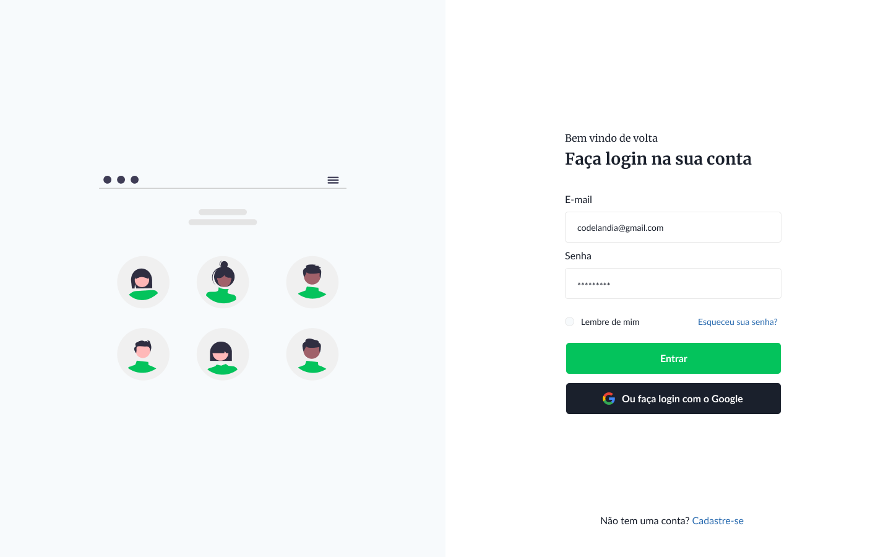

# Simples página de Login

## Resultado Final



# Desafio Página

>Criar uma página igual ao layout do Resultado Final (imagem ao lado).
Pode criar animações em JavaScript e em sytle com CSS.
Obedeça a semântica e a sintaxe de marcações.

- Siga as boas práticas vista em estudo;
- Revise a organização dos containers;
- Revise os nomes criados;
- Ao finalizar: descreva neste README sobre a organização;

## Segue documentações para auxiliar

[Doc Firefox HTML](https://developer.mozilla.org/pt-BR/docs/Web/HTML)

[Doc Firefox CSS](https://developer.mozilla.org/pt-BR/docs/Web/CSS)

[Doc Firefox JavaScript](https://developer.mozilla.org/pt-BR/docs/Web/JavaScript)

[HTML: Linguagem de Marcação de Hipertexto](https://developer.mozilla.org/pt-BR/docs/Web/HTML)

[Gradiente color CSS](https://cssgradient.io/)

[HTML5 Validator - validando formulários](https://www.devmedia.com.br/html5-validator-validando-formularios-com-html5/28785)

[Como copiar cor de uma imagem](https://redketchup.io/color-picker)

------

### Especificações

```
<meta name="google-signin-scope" content="profile email">
    <meta name="google-signin-client_id"
        content="505881512605-ligonvmfu2mpa11k01h8c97k6bsof111.apps.googleusercontent.com">
    <script src="https://apis.google.com/js/platform.js" async defer></script>
    <script src="https://apis.google.com/js/platform.js?onload=init" async defer></script>
    <link rel="stylesheet" href="https://jqueryvalidation.org/files/demo/site-demos.css">


    Cores predominantes:

    #F7FAFC;
    #2B6CB0;
    #04C45C; 

```


## Sobre a página

>Como acessar na web?
