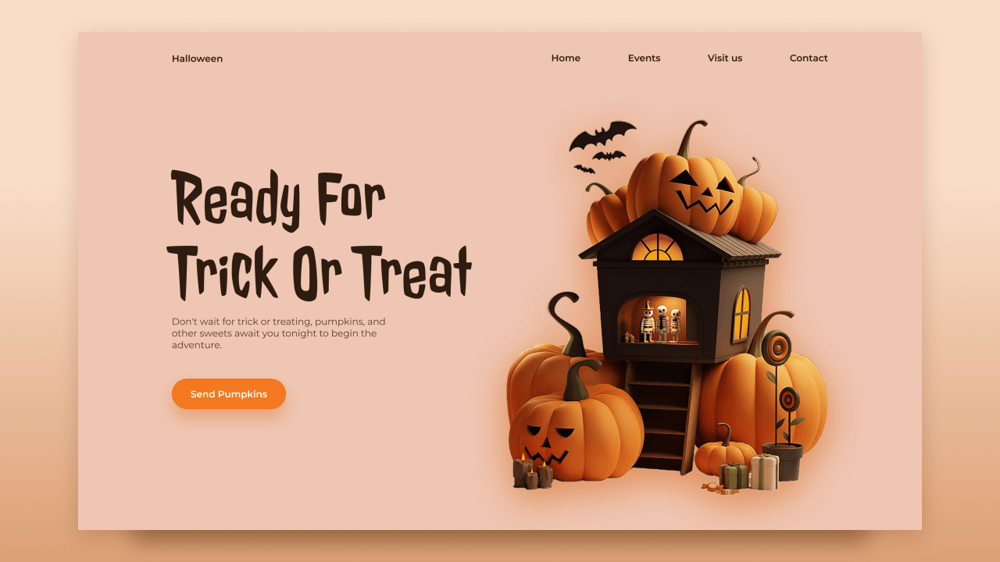

# Website responsivo de Halloween

- Design responsivo de um site de Halloween usando HTML, CSS e JavaScript.
- Deve conter um efeito piscante que altera a imagem das abóboras.            
    Exemplo: Ao clicar ou passar o mouse em algum local específico da tela, a imagem deve ser alterada.
- Deve ser compatível com todos os dispositivos móveis e com uma interface de usuário bonita e agradável.

## Links

 Utilize as documentações de JS, HTML e CSS quando necessário.
>
>>* [HTML Mozilla doc](https://developer.mozilla.org/pt-BR/docs/Web/HTML)
>>* [CSS Mozilla doc](https://developer.mozilla.org/pt-BR/docs/Web/CSS)
>>* [JS Mozilla doc](https://developer.mozilla.org/pt-BR/docs/Web/JavaScript)
>
>
Fontes: 
>
>>* [Google fonts](https://fonts.google.com/)

Imagens originais:

>>* [Imagens](https://dribbble.com/shots/22830157-Time-to-get-spooky)